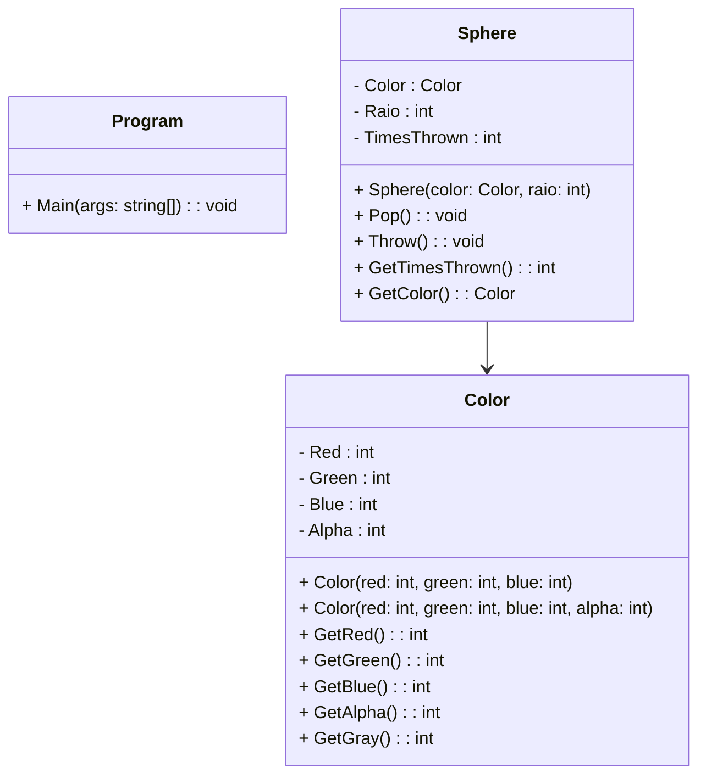

# BetterColorSpheres

## Diagrama UML das Classes

```mermaid
classDiagram
    class Program {
        + Main(args: string[]) : void
    }

    class Color {
        - Red : int
        - Green : int
        - Blue : int
        - Alpha : int
        + Color(red: int, green: int, blue: int)
        + Color(red: int, green: int, blue: int, alpha: int)
        + GetRed() : int
        + GetGreen() : int
        + GetBlue() : int
        + GetAlpha() : int
        + GetGray() : int
    }

    class Sphere {
        - Color : Color
        - Raio : int
        - TimesThrown : int
        + Sphere(color: Color, raio: int)
        + Pop() : void
        + Throw() : void
        + GetTimesThrown() : int
        + GetColor() : Color
    }

    Sphere --> Color
```
